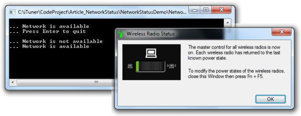

<h1>NetworkStatus</h1>

This is a copy of <a href="https://www.codeproject.com/Articles/64975/Detect-Internet-Network-Availability">my original argicle on codeproject</a>.

<h2>Contents</h2>

<ul>
	<li><a href="#Introduction">Introduction</a></li>
	<li><a href="#Background">Background</a></li>
	<li><a href="#UsingTheCode">Using the Code</a></li>
	<li><a href="#InsideTheCode">Inside the Code</a>
	<ul>
		<li><a href="#NetworkInterface">NetworkInterface Class</a></li>
		<li><a href="#NetworkChange">NetworkChange Class</a></li>
	</ul>
	</li>
	<li><a href="#Conclusion">Conclusion</a></li>
</ul>

<h2><a name="Introduction">Introduction</a></h2>

This article describes a small class that can be used to determine network availability and detect when changes occur in connectivity. This focuses on &quot;Internet availability&quot;. In other words, if at least one IP related interface is available and working, then we assume the &quot;network&quot; is available.

<h2><a name="Background">Background</a></h2>

The <a href="http://ituner.codeplex.com/">iTuner</a> lyrics engine relies on online providers to search for song lyrics. It reaches out to the Internet whenever a song that does not yet have lyrics begins playing. Requirements specific to iTuner are as follows:

<ul>
	<li>Determine the current connectivity state</li>
	<li>Subscribe to be notified when changes occur in network connectivity</li>
	<li>Ignore all network adapters that probably do not provide connectivity to the Internet since my main goal was to contact Internet resources</li>
</ul>

This led to the <code>System.Net.NetworkInformation </code>namespace and the thin wrapper presented below. There are a couple of scenarios that these <code>System </code>classes do not cover and this article addresses those.&nbsp;Of course, you could generalize these requirements for any application or extend this class with other features such as <em>pinging</em> a target site to check for existence prior to heavier&nbsp;communication.

<h2><a name="UsingTheCode">Using the Code</a></h2>

The <code>NetworkStatus</code> class is a <code>static </code>class exposing one method and one event as shown here:

<pre lang="cs">
public static class NetworkStatus
{
    public static event NetworkStatusChangedHandler AvailabilityChanged;
    public static bool IsAvailable { get; }
}</pre>

As you can see, there&#39;s not much to it - and that&#39;s the point.&nbsp; Although there&#39;s not an immense amount of code behind this class, it encapsulates all the messiness so we don&#39;t have to worry about the details. The <code>NetworkStatusDemo </code>application attached to this article demonstrates the most minimal use of this class. It first reports the current network availability using the <code>IsAvailable</code> property.

<pre lang="cs">
if (NetworkStatus.IsAvailable)
{
    Console.WriteLine(&quot;... Network is available&quot;);
}
else
{
    Console.WriteLine(&quot;... Network is not available&quot;);
}</pre>

<code>NetworkStatusDemo </code>then attaches a <code>NetworkStatusChangedHandler</code> handler to the <code>AvailabilityChanged</code> event.

<pre lang="cs">
NetworkStatus.AvailabilityChanged +=
    new NetworkStatusChangedHandler(DoAvailabilityChanged);

static void DoAvailabilityChanged (
    object sender, NetworkStatusChangedArgs e)
{
    if (e.IsAvailable)
    {
        Console.WriteLine(&quot;... Network is available&quot;);
    }
    else
    {
        Console.WriteLine(&quot;... Network is not available&quot;);
    }
}</pre>

Quite simple, but it&#39;s enough to determine whether we should attempt to contact a Web site or Web service at any specific point in time.

<h2><a name="InsideTheCode">Inside the Code</a></h2>

While the original .NET classes provide most of the functionality needed here, I had two primary objectives:

<ol>
	<li>Narrow the scope of the <code>NetworkInterface </code>class to only report on adapters&nbsp;capable of connecting&nbsp;to the Internet</li>
	<li>Encapsulate the multiple events offered by the <code>NetworkChange </code>class</li>
</ol>

<h3><a name="NetworkInterface">System.Net.NetworkInformation.NetworkInterface</a></h3>

The <code>NetworkInteface </code>class includes the <code>static GetIsNetworkAvailable() </code>method. While this method already does most of the work we need, I&#39;ve found there are situations, especially with wireless adapters, where the network appears to be online but has not yet established a truly open connection to the network.&nbsp;It also sees virtual machine adapters and thinks they are online; obviously, unless you&#39;ve some strange development configuration where you&#39;re using a virtual machine as a router, these are not going to lead you to the Internet.

We begin with a quick test using <code>GetIsNetworkAvailable </code>but then extend that by examining each appropriate network interface for activity, <code>BytesReceived</code> and <code>BytesSent</code>. This is encapsulated in our <code>NetworkStatus.IsNetworkAvailable() </code>method.

<pre lang="cs">
private static bool IsNetworkAvailable ()
{
    // only recognizes changes related to Internet adapters
    if (NetworkInterface.GetIsNetworkAvailable())
    {
        // however, this will include all adapters
        NetworkInterface[] interfaces =
            NetworkInterface.GetAllNetworkInterfaces();

        foreach (NetworkInterface face in interfaces)
        {
            // filter so we see only Internet adapters
            if (face.OperationalStatus == OperationalStatus.Up)
            {
                if ((face.NetworkInterfaceType != NetworkInterfaceType.Tunnel) &amp;&amp;
                    (face.NetworkInterfaceType != NetworkInterfaceType.Loopback))
                {
                    IPv4InterfaceStatistics statistics =
                        face.GetIPv4Statistics();

                    // all testing seems to prove that once an interface
                    // comes online it has already accrued statistics for
                    // both received and sent...

                    if ((statistics.BytesReceived &gt; 0) &amp;&amp;
                        (statistics.BytesSent &gt; 0))
                    {
                        return true;
                    }
                }
            }
        }
    }

    return false;
}</pre>

While this is sufficient to test for current availability, we can optimize efficiency by maintaining a <code>private Boolean </code>variable, <code>isAvailable</code>, and setting its state only when the connectivity status changes. This is where the <code>NetworkChange </code>class comes into play.

<h3><a name="NetworkChange">System.Net.NetworkInformation.NetworkChange</a></h3>

The <code>NetworkChange </code>class has two events, <code>NetworkAvailabilityChanged</code> and <code>NetworkAddressChanged</code>. Sounds great. But the problem is that <code>NetworkChange </code>does not discriminate against adapters that might not grant us access to the Internet, such as tunnel adapters. So our <code>NetworkStatus </code>class extends this capability to include events from only relevant adapters. We manage this by tightly controlling the <code>NetworkAvailabilityChanged </code>and <code>NetworkAddressChanged </code>events ourselves, hiding them behind our own <code>AvailabilityChanged</code> event.

<pre lang="cs">
public static event NetworkStatusChangedHandler AvailabilityChanged
{
    add
    {
        if (handler == null)
        {
            NetworkChange.NetworkAvailabilityChanged
                += new NetworkAvailabilityChangedEventHandler(
                   DoNetworkAvailabilityChanged);

            NetworkChange.NetworkAddressChanged
                += new NetworkAddressChangedEventHandler(
                   DoNetworkAddressChanged);
        }

        handler = (NetworkStatusChangedHandler)Delegate.Combine(handler, value);
    }

    remove
    {
        handler = (NetworkStatusChangedHandler)Delegate.Remove(handler, value);

        if (handler == null)
        {
            NetworkChange.NetworkAvailabilityChanged
                -= new NetworkAvailabilityChangedEventHandler(
                   DoNetworkAvailabilityChanged);

            NetworkChange.NetworkAddressChanged
                -= new NetworkAddressChangedEventHandler(
                   DoNetworkAddressChanged);
        }
    }
}</pre>

You can see that we provide our own <code>handler</code> variable.&nbsp; This is defined as an event that we can fire when we want to signal state changes to our consumers.

Unfortunately, the handlers for the two wrapped events do not have similar signatures. So we need to supply two distinct handlers. But they both funnel into a single point, <code>SignalAvailabilityChange</code>.

<pre lang="cs">
private static void SignalAvailabilityChange (object sender)
{
    bool change = IsNetworkAvailable();
    // only signal consumers when the general state changes
    if (change != isAvailable)
    {
        // set the local isAvailable variable
        isAvailable = change;
        if (handler != null)
        {
            handler(sender, new NetworkStatusChangedArgs(isAvailable));
        }
    }
}</pre>

In the end, not a lot of code and not very complicated or revolutionary. But it&#39;s proven to be a tidy implementation that helps to simplify&nbsp;any main application.

